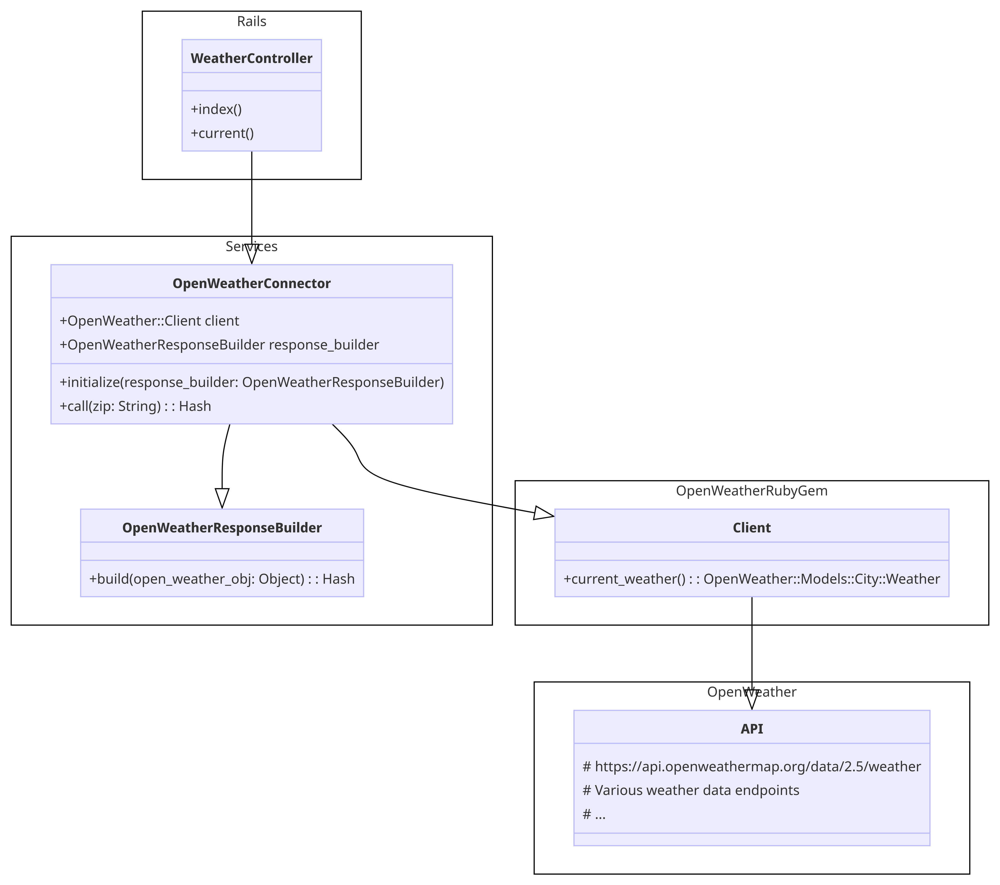
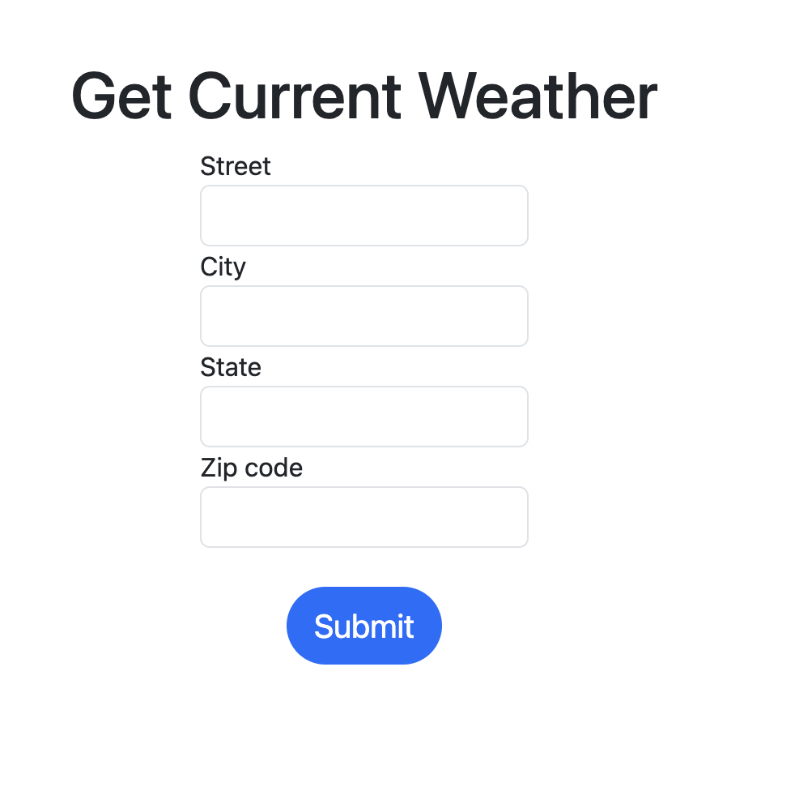
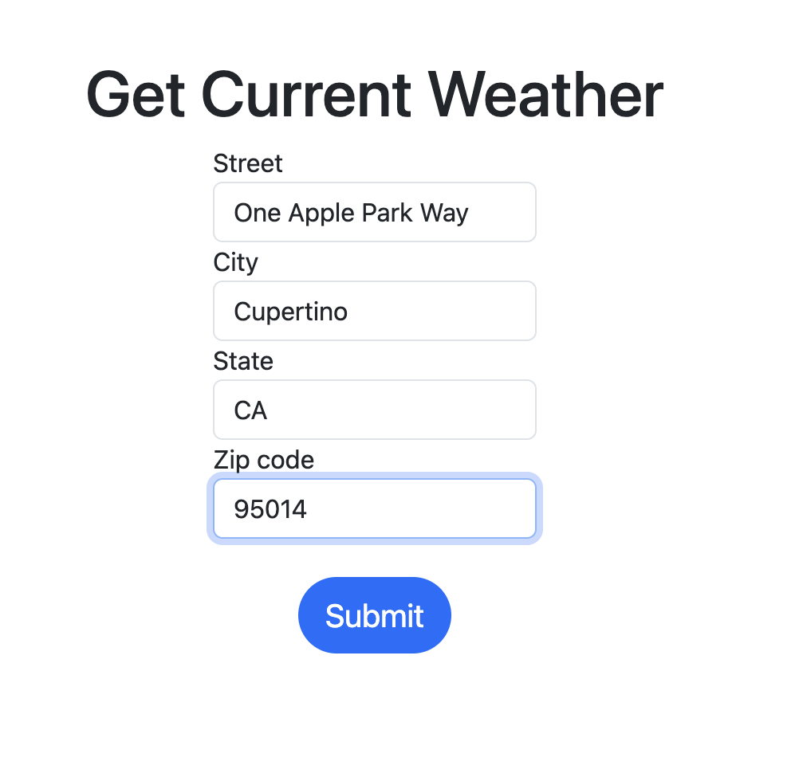
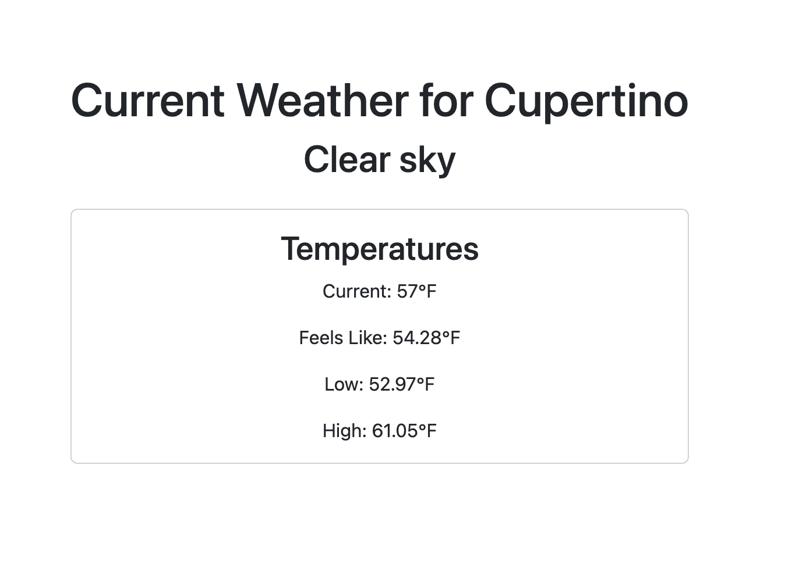
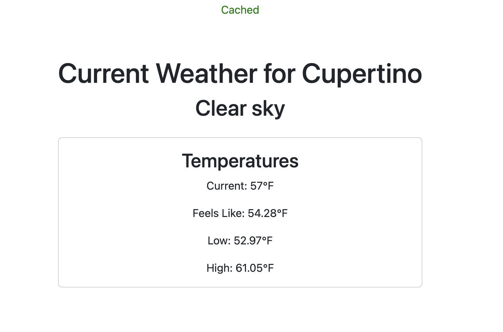

# README

Rails app to get weather from US address using OpenWeather API.

## Application Design


Rails `WeatherController#current` calls `Services::OpenWeatherConnector` which is responsible for calling the OpenWeather API.

`OpenWeatherConnector` uses the [open-weather-ruby-client gem](https://github.com/dblock/open-weather-ruby-client).

`OpenWeatherConnector` uses `OpenWeatherResponseBuilder` to build a data response for the `WeatherController`. `OpenWeatherResponseBuilder` is based on the factory design pattern. This will allow us to easily extend the application to support multiple API data sources or multiple endpoint as we add features.

## Dependencies
- Ruby 3
- Rails 7
- Redis
- Postgres

## App Setup
```sh
bundle install
rails db:setup
rails s
```

## Testing
`rspec`

## Screenshots
Homepage


With Invalid Fields


With Valid Fields


Cache Miss


Cache Hit

