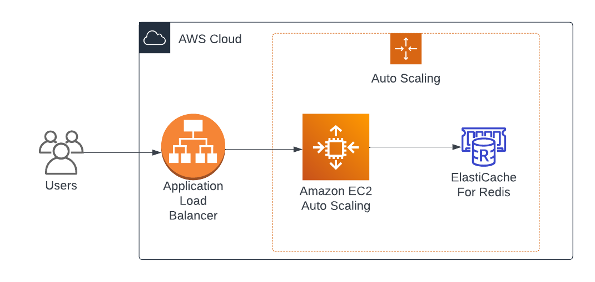
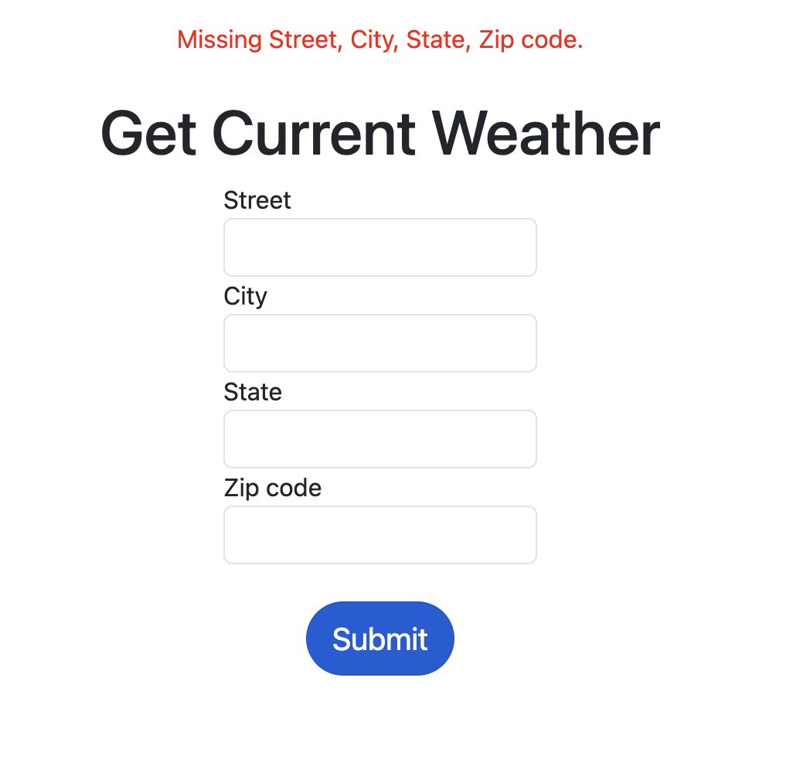

# README

Rails app to get weather from US address using OpenWeather API.

## Application Design


The Rails `WeatherController#current` action calls `Services::OpenWeatherConnector` which is encapsulates calling the OpenWeather API and build a response.

`OpenWeatherConnector` uses the [open-weather-ruby-client gem](https://github.com/dblock/open-weather-ruby-client).

`OpenWeatherConnector` uses `OpenWeatherResponseBuilder` to build a data response for the `WeatherController`. `OpenWeatherResponseBuilder` is based on the factory design pattern. This will allow us to easily extend the application to support multiple API data sources or multiple endpoint as we add features.

## Scalability
This application is stateless and can run with or without a database. The no database version is on a separate branch: [remove-db](https://github.com/Druwerd/weather/branches).

To scale up the application you could setup your infrastructure architecture such that web application instances and Redis cluster nodes as are dynamically increased as load increases. See example diagram below.

Additionally you could server static assets such as images, css, javascript from a CDN.



## Dependencies
- Ruby 3
- Rails 7
- Redis
- Postgres (optional see branch [remove-db](https://github.com/Druwerd/weather/branches))

## App Setup
```sh
bundle install
rails db:setup
rails s
```

## Testing
`rspec`

## Screenshots
Homepage


With Invalid Fields


With Valid Fields


Cache Miss


Cache Hit

